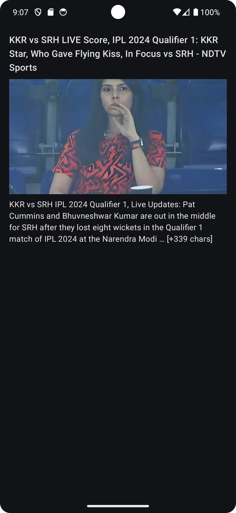

# News App

Welcome to the News App repository! This project is a simple yet comprehensive news application developed to enhance my knowledge of APIs, Jetpack Compose, Navigation, MVVM architecture, and Coroutines in Android development.

## Table of Contents
- [Overview](#overview)
- [Features](#features)
- [Technologies Used](#technologies-used)
- [Screenshots](#screenshots)
- [Installation](#installation)
- [Usage](#usage)
- [Contributing](#contributing)
- [License](#license)
- [Contact](#contact)

## Overview

The News App allows users to browse the latest news articles from various categories. It fetches news data from a public API and displays it using a modern Android UI built with Jetpack Compose. This project serves as a practical demonstration of implementing key Android development concepts.

## Features

- Browse news articles from multiple categories
- View detailed news articles
- Smooth navigation using Jetpack Navigation Component
- Responsive UI built with Jetpack Compose
- Robust architecture following the MVVM pattern
- Efficient data handling using Coroutines for asynchronous operations

## Technologies Used

- **Programming Language:** Kotlin
- **UI Framework:** Jetpack Compose
- **Architecture:** MVVM (Model-View-ViewModel)
- **Navigation:** Jetpack Navigation Component
- **Asynchronous Operations:** Coroutines
- **Network Requests:** Retrofit
- **API:** [NewsAPI](https://newsapi.org/)

## Screenshots

                                             

## Installation

To run this project locally, follow these steps:

1. **Clone the repository:**
    ```bash
    git clone https://github.com/AnimeshNilawar/News-App
    ```

2. **Open the project in Android Studio.**

3. **Sync the project with Gradle files.**

4. **Obtain an API key** from the news API provider (e.g., NewsAPI).

5. **Add the API key** to `ApiService` file:
    ```properties
    apiKey: String = "YOUR_API_KEY"
    ```

6. **Run the app** on your emulator or physical device.

## Usage

Once installed, you can:

- Browse news by category (e.g., technology, sports, health).
- Tap on any news article to read its details.
- Navigate back and forth between screens seamlessly.

## Contributing

Contributions are welcome! If you have any suggestions, bug reports, or improvements, feel free to open an issue or submit a pull request.

1. **Fork the repository.**
2. **Create a new branch:**
    ```bash
    git checkout -b feature/your-feature-name
    ```
3. **Make your changes and commit them:**
    ```bash
    git commit -m 'Add some feature'
    ```
4. **Push to the branch:**
    ```bash
    git push origin feature/your-feature-name
    ```
5. **Open a pull request.**

## License

This project is licensed under the MIT License. See the [LICENSE](LICENSE) file for details.

## Contact

If you have any questions or feedback, feel free to reach out:

- **Email:** nilawaranimesh@gmail.com
## 🔗 Links

[](https://www.linkedin.com/in/animesh-nilawar/)
